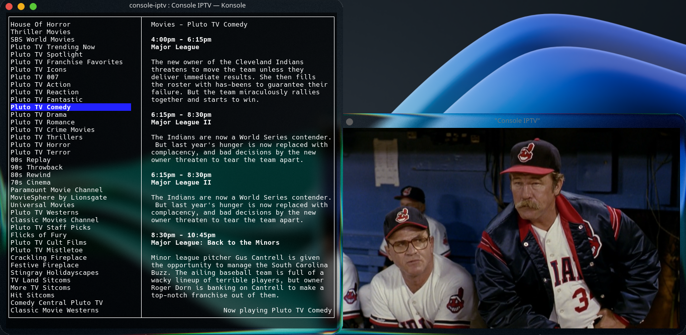

# Console IPTV
A simple console application to display an IPTV playlist (m3u8) and epg (xmltv). Stream playback uses mpv.



## Controls

### Keyboard
- Up and down arrows will select channels in the channel list
- Enter will launch mpv for the selected channel
- 'x' will add the channel (id) to the list of excluded channels
- 'q' or 'ctrl+c' will quit the application (and close mpv)

### Mouse
- Scroll will can be used to scroll the channel list and the epg list
- Clicking a channel list entry will select the entry
- Clicking a selected channel list entry will launch mpv

## Headers
- pipe separated headers are supported (so X-forwarded-for can be used)

## Configuration
- The configuration file is read from $HOME/.config/console-iptv.json

### Configuration file format
- The configuration file is json

### Fields
- channelFilter: a regular express that, when matched with the channel name, will exclude the channel
- groupFiler: same as channelFilter but matches against the tvg-group
- excludedChannelIds: an array of tvg-ids (strings) for channels that are excluded (usually added with 'x' key)
- m3u8: the playlist url
- xmltv: the epg url

### Example
```json
{
  "m3u8": "http://192.168.1.9:8080/playlist",
  "xmltv": "http://192.168.1.9:8080/iptv/scraper/xmltv",
  "groupFilter": "(Local News|En Español|Music|News|Daytime|Classic)",
  "channelFilter": "(Example 1)",
  "excludedChannelIds": [
    "tvg-id-1234"
  ]
}
```

## Some other things I am thinking of
- add configurable mpv options
- a configuration screen


## Made with several open source projects
- blessed: the TUI framework
- epg-parser: a straight forward xmltv parser
- iptv-parser: an almost swiss army knife for IPTV streams
- node-mpv-2: for launching and controlling mpv
